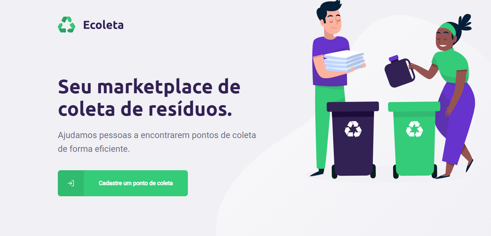
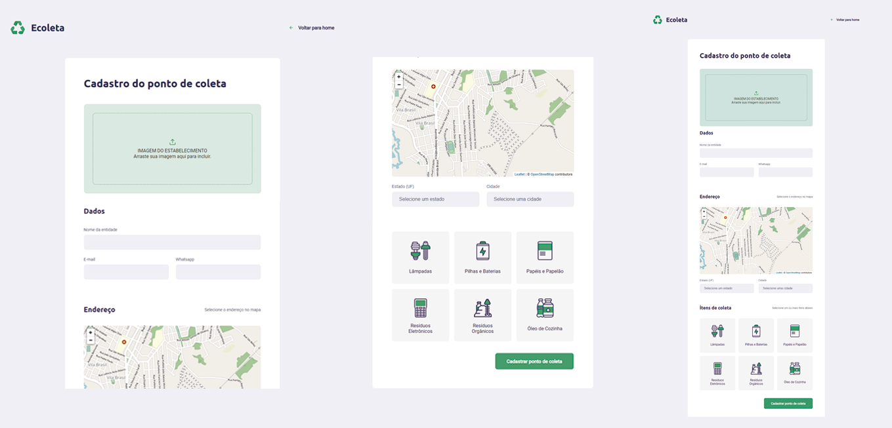
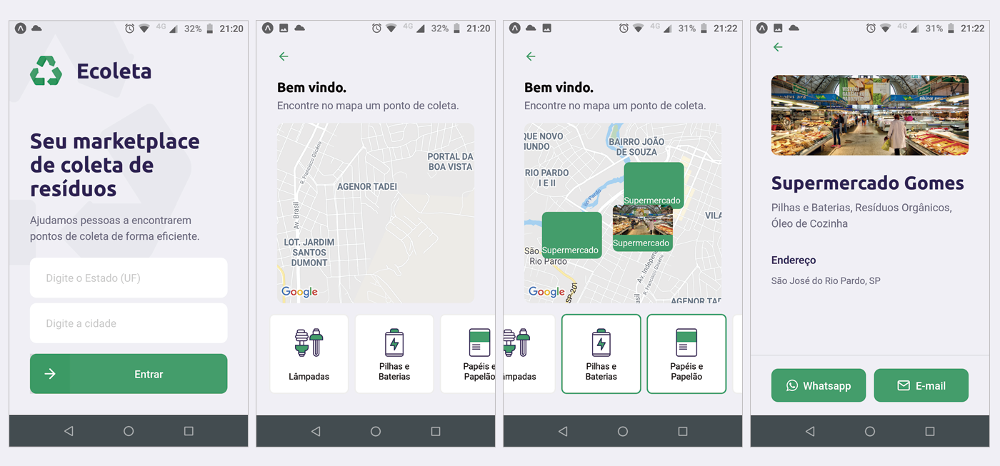

<h1 align="center">
  
</h1>

<h2 align="center">:recycle: Ecoleta</h2>
<p> 
  O <strong>Ecoleta</strong> é uma aplicação Web e Mobile com a finalidade de conectar pessoas e pontos de coleta de resíduos orgânicos e inorgânicos, permitindo o descarte desses materiais de forma correta e <strong>ecológica</strong>.
  
  O Projeto foi desenvolvido durante o bootcamp <strong>Next Level Week #01</strong> da [Rocketseat](https://rocketseat.com.br/).
</p>

## :dart: Índice
- [Status](#status)
- [Layout](#layout)
- [Tecnologias](#tecnologias)
- [Pré-Requisitos](#pre-requisitos)
- [Executando o projeto](#executando-o-projeto)
- [Licença](#licença)

## :game_die: Status
<p align="center">
  
  
  
  
</p>

## :framed_picture: Layout

### Web


### Mobile


## :toolbox: Tecnologias
- [Node.js](https://nodejs.org/)
- [React](https://reactjs.org)
- [React Native](https://reactnative.dev/)
- [TypeScript](https://www.typescriptlang.org/)
- [Knex](http://knexjs.org/)
- [Expo](https://expo.io/)

## :heavy_check_mark: Pré-requisitos
Antes de iniciar, certifique-se que tenha instalado em seu computador as seguintes ferramentas:
- [Node.js](https://nodejs.org/)
- [Git](https://git-scm.com/downloads)

## :gear: Executando o projeto
O projeto está dividido em 3 partes:
- Back end - diretório [server](./server)
- Front end - diretório [web](./web)
- Mobile - diretório [mobile](./mobile)

**OBS:** Para o correto funcionamento das aplicações Web (Front End) e Mobile é necessário que o Server (Back End) esteja sendo executado.

1. *Faça um clone do repositório:*

```sh
$ git clone https://github.com/LuizEduardoBilotta/ecoleta.git
```

2. *Para cada parte do projeto, siga as etapas abaixo:*

### Executando o Back End (server)

```sh
# Acesse o diretório no terminal:
$ cd ecoleta

# Acesse o diretório server:
$ cd server

# Instale as dependências:
$ npm install

# Configurando o banco de dados (Criação de tabelas no sqLite3 e inserindo os itens pré-cadastrados):
$ npm run knex:migrate
$ npm run knex:seed

# Execute a aplicação:
$ npm run dev
```

### Executando o Front End (web)

```sh
# Acesse o diretório no terminal:
$ cd ecoleta

# Acesse o diretório web:
$ cd web

# Instale as dependências:
$ npm install

# Execute a aplicação:
$ npm start
```

**OBS:** Caso não inicie a aplicação automaticamente em seu navegador, acesse manualmente digitando na barra de endereços: `localhost:3000`

### Executando o Mobile (mobile)

```sh
# Acesse o diretório no terminal:
$ cd ecoleta

# Acesse o diretório mobile:
$ cd mobile

# Instale as dependências:
$ npm install

# Instale o expo globalmente
$ npm install -g expo-cli

# Execute a aplicação:
$ expo start
```

**OBS:** Caso não inicie a aplicação automaticamente em seu navegador, acesse manualmente digitando na barra de endereços: `localhost:19002`

## :bookmark_tabs: Licença
Este projeto está licenciado nos termos da licença MIT. Veja o arquivo [LICENSE](./LICENSE) para mais detalhes.

## :jigsaw: Contato
- :mailbox_with_mail: E-mail: <a href="mailto:luizeduardobilotta@gmail.com">luizeduardobilotta@gmail.com</a>
- :pushpin: Linkedin: [in/luizeduardobilotta](https://www.linkedin.com/in/luizeduardobilotta)

<sup>Desenvolvido por <i><strong>Luiz Eduardo Bilotta.</i></strong></sup>
